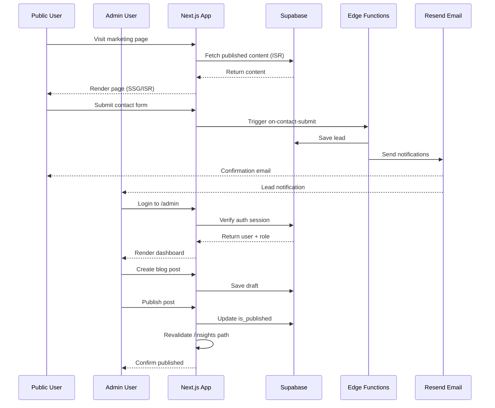

# Design Document: Complete Industrial-Grade ASCIRVO Website

## Overview

This design completes the ASCIRVO corporate website to industrial-grade standards, implementing all missing features from the PRD while applying enterprise UI/UX patterns inspired by Infosys. The implementation focuses on: (1) Admin Dashboard/CMS with role-based access, (2) Dynamic content management for blogs/case studies/jobs, (3) Enterprise UI polish with animations and accessibility, (4) Performance optimization for Core Web Vitals, and (5) Production-ready security and deployment.

**Current State:** Marketing pages structure exists with basic components. Supabase backend configured but admin CMS not implemented.

**Target State:** Fully functional enterprise website with complete admin CMS, polished UI matching Infosys standards, Lighthouse scores ≥90 performance/≥95 accessibility, production-ready deployment.

## Main Algorithm/Workflow



## Core Interfaces/Types

```typescript
// types/database.ts - Core database types

interface BlogPost {
  id: string;
  title: string;
  slug: string;
  excerpt: string;
  content: TiptapJSON; // ProseMirror JSON format
  category: BlogCategory;
  tags: string[];
  author_name: string;
  author_avatar_url: string;
  cover_image_url: string;
  read_time_minutes: number;
  is_published: boolean;
  published_at: Date | null;
  created_at: Date;
  updated_at: Date;
}

interface CaseStudy {
  id: string;
  title: string;
  slug: string;
  client_name: string;
  client_logo_url: string;
  industry: Industry;
  service: Service;
  region: Region;
  challenge: string;
  solution: string;
  results: ResultStat[];
  technologies: string[];
  testimonial: string | null;
  cover_image_url: string;
  is_published: boolean;
  created_at: Date;
  updated_at: Date;
}

interface JobListing {
  id: string;
  title: string;
  slug: string;
  department: Department;
  location: string;
  employment_type: EmploymentType;
  experience_level: ExperienceLevel;
  description: string;
  responsibilities: string[];
  requirements_must: string[];
  requirements_nice: string[];
  benefits: string[];
  is_active: boolean;
  posted_at: Date;
  closes_at: Date | null;
  created_at: Date;
}

interface JobApplication {
  id: string;
  job_id: string;
  applicant_name: string;
  email: string;
  phone: string | null;
  linkedin_url: string | null;
  resume_path: string;
  cover_letter: string;
  status: ApplicationStatus;
  applied_at: Date;
}

interface ContactLead {
  id: string;
  name: string;
  email: string;
  phone: string | null;
  company: string;
  country: string;
  service_interest: Service;
  message: string;
  status: LeadStatus;
  created_at: Date;
}

interface AdminProfile {
  id: string;
  full_name: string;
  role: AdminRole;
  avatar_url: string | null;
  created_at: Date;
}

interface PageContent {
  id: string;
  page_key: string;
  section_key: string;
  content: Record<string, any>;
  updated_by: string;
  updated_at: Date;
}

interface TeamMember {
  id: string;
  full_name: string;
  job_title: string;
  department: string;
  bio: string;
  photo_url: string;
  linkedin_url: string | null;
  display_order: number;
  is_featured: boolean;
  is_active: boolean;
}

interface Testimonial {
  id: string;
  quote: string;
  client_name: string;
  client_title: string;
  company: string;
  photo_url: string | null;
  logo_url: string | null;
  display_order: number;
  is_active: boolean;
}

interface Partner {
  id: string;
  company_name: string;
  logo_url: string;
  website_url: string | null;
  category: PartnerCategory;
  display_order: number;
  is_active: boolean;
}

// Enums
type BlogCategory = 'AI' | 'Cloud' | 'Security' | 'Data' | 'Digital Transformation' | 'Industry News';
type Industry = 'Banking' | 'Healthcare' | 'Manufacturing' | 'Retail' | 'Energy' | 'Government';
type Service = 'AI/ML' | 'Cloud' | 'Cybersecurity' | 'Data Analytics' | 'Digital Transformation' | 'Software Engineering' | 'Consulting';
type Region = 'Asia Pacific' | 'North America' | 'Europe' | 'Middle East' | 'Global';
type Department = 'Engineering' | 'Data & AI' | 'Cloud' | 'Consulting' | 'Sales' | 'HR' | 'Finance' | 'Operations';
type EmploymentType = 'Full-time' | 'Part-time' | 'Contract' | 'Internship';
type ExperienceLevel = 'Entry' | 'Mid' | 'Senior' | 'Lead' | 'Director';
type ApplicationStatus = 'received' | 'reviewing' | 'interview' | 'offer' | 'rejected';
type LeadStatus = 'new' | 'read' | 'contacted' | 'closed';
type AdminRole = 'super_admin' | 'admin' | 'editor';
type PartnerCategory = 'Technology Partner' | 'Client' | 'Alliance Partner';

interface ResultStat {
  stat: string;
  label: string;
}

interface TiptapJSON {
  type: 'doc';
  content: TiptapNode[];
}

interface TiptapNode {
  type: string;
  attrs?: Record<string, any>;
  content?: TiptapNode[];
  marks?: TiptapMark[];
  text?: string;
}

interface TiptapMark {
  type: string;
  attrs?: Record<string, any>;
}
```


## Key Functions with Formal Specifications

### Function 1: createSupabaseServerClient()

```typescript
// lib/supabase/server.ts
import { createServerClient } from '@supabase/ssr';
import { cookies } from 'next/headers';

export async function createSupabaseServerClient() {
  const cookieStore = await cookies();
  
  return createServerClient(
    process.env.NEXT_PUBLIC_SUPABASE_URL!,
    process.env.NEXT_PUBLIC_SUPABASE_ANON_KEY!,
    {
      cookies: {
        getAll() {
          return cookieStore.getAll();
        },
        setAll(cookiesToSet) {
          cookiesToSet.forEach(({ name, value, options }) => {
            cookieStore.set(name, value, options);
          });
        },
      },
    }
  );
}
```

**Preconditions:**
- `NEXT_PUBLIC_SUPABASE_URL` and `NEXT_PUBLIC_SUPABASE_ANON_KEY` environment variables are defined
- Function called in Server Component or Server Action context
- Next.js cookies() API available

**Postconditions:**
- Returns configured Supabase client with cookie-based session management
- Client automatically handles session refresh
- All subsequent queries use authenticated session if available

**Loop Invariants:** N/A

---

### Function 2: requireAdminAuth()

```typescript
// lib/auth/require-admin.ts
import { createSupabaseServerClient } from '@/lib/supabase/server';
import { redirect } from 'next/navigation';

export async function requireAdminAuth(requiredRole?: AdminRole) {
  const supabase = await createSupabaseServerClient();
  
  const { data: { user }, error } = await supabase.auth.getUser();
  
  if (error || !user) {
    redirect('/admin/login');
  }
  
  const { data: profile } = await supabase
    .from('admin_profiles')
    .select('*')
    .eq('id', user.id)
    .single();
  
  if (!profile) {
    redirect('/admin/login');
  }
  
  if (requiredRole) {
    const roleHierarchy = { super_admin: 3, admin: 2, editor: 1 };
    const userLevel = roleHierarchy[profile.role];
    const requiredLevel = roleHierarchy[requiredRole];
    
    if (userLevel < requiredLevel) {
      redirect('/admin');
    }
  }
  
  return { user, profile };
}
```

**Preconditions:**
- Function called in Server Component or Server Action
- Supabase client properly configured
- `admin_profiles` table exists with RLS policies

**Postconditions:**
- If user not authenticated: redirects to `/admin/login`
- If user lacks admin profile: redirects to `/admin/login`
- If user lacks required role: redirects to `/admin`
- Otherwise: returns user and profile objects
- No return value if redirect occurs (function exits)

**Loop Invariants:** N/A

---

### Function 3: publishContent()

```typescript
// app/actions/content.ts
'use server';

import { createSupabaseServerClient } from '@/lib/supabase/server';
import { requireAdminAuth } from '@/lib/auth/require-admin';
import { revalidatePath } from 'next/cache';

export async function publishContent(
  table: 'blog_posts' | 'case_studies' | 'newsroom_posts',
  id: string,
  pathToRevalidate: string
) {
  await requireAdminAuth('admin');
  
  const supabase = await createSupabaseServerClient();
  
  const { data, error } = await supabase
    .from(table)
    .update({
      is_published: true,
      published_at: new Date().toISOString(),
      updated_at: new Date().toISOString(),
    })
    .eq('id', id)
    .select()
    .single();
  
  if (error) {
    return { success: false, error: error.message };
  }
  
  // Trigger ISR revalidation
  revalidatePath(pathToRevalidate);
  revalidatePath('/'); // Revalidate home page if content appears there
  
  // Log audit trail
  await logAuditEvent({
    action: 'publish',
    resource_type: table,
    resource_id: id,
    resource_title: data.title,
  });
  
  return { success: true, data };
}
```

**Preconditions:**
- User authenticated with `admin` or `super_admin` role
- `table` is one of the allowed content tables
- `id` exists in the specified table
- `pathToRevalidate` is a valid Next.js route path

**Postconditions:**
- Content record updated with `is_published: true` and `published_at` timestamp
- ISR cache invalidated for specified path and home page
- Audit log entry created
- Returns success object with updated data or error object

**Loop Invariants:** N/A

---

### Function 4: uploadToSupabaseStorage()

```typescript
// lib/storage/upload.ts
import { createSupabaseServerClient } from '@/lib/supabase/server';

export async function uploadToSupabaseStorage(
  file: File,
  bucket: string,
  folder: string
) {
  const supabase = await createSupabaseServerClient();
  
  // Generate unique filename
  const fileExt = file.name.split('.').pop();
  const fileName = `${Date.now()}-${Math.random().toString(36).substring(7)}.${fileExt}`;
  const filePath = `${folder}/${fileName}`;
  
  // Upload file
  const { data, error } = await supabase.storage
    .from(bucket)
    .upload(filePath, file, {
      cacheControl: '3600',
      upsert: false,
    });
  
  if (error) {
    return { success: false, error: error.message };
  }
  
  // Get public URL
  const { data: { publicUrl } } = supabase.storage
    .from(bucket)
    .getPublicUrl(filePath);
  
  return {
    success: true,
    path: filePath,
    url: publicUrl,
  };
}
```

**Preconditions:**
- `file` is a valid File object
- `bucket` exists in Supabase Storage
- `folder` is a valid path string
- User has upload permissions for the bucket

**Postconditions:**
- File uploaded to Supabase Storage with unique filename
- Returns object with success status, storage path, and public URL
- If upload fails, returns error object
- Filename collision impossible due to timestamp + random string

**Loop Invariants:** N/A


---

### Function 5: validateFormWithZod()

```typescript
// lib/validations/form-validator.ts
import { z } from 'zod';

export async function validateFormWithZod<T extends z.ZodType>(
  schema: T,
  formData: FormData
): Promise<{ success: true; data: z.infer<T> } | { success: false; errors: Record<string, string[]> }> {
  const rawData = Object.fromEntries(formData.entries());
  
  const result = await schema.safeParseAsync(rawData);
  
  if (result.success) {
    return { success: true, data: result.data };
  }
  
  const errors: Record<string, string[]> = {};
  result.error.issues.forEach((issue) => {
    const path = issue.path.join('.');
    if (!errors[path]) {
      errors[path] = [];
    }
    errors[path].push(issue.message);
  });
  
  return { success: false, errors };
}
```

**Preconditions:**
- `schema` is a valid Zod schema
- `formData` is a FormData object from form submission

**Postconditions:**
- If validation succeeds: returns `{ success: true, data }` with typed data
- If validation fails: returns `{ success: false, errors }` with field-level error messages
- All form fields validated according to schema rules
- Type safety maintained through Zod inference

**Loop Invariants:**
- For each validation issue, exactly one error message added to errors object
- All issues processed before function returns

---

### Function 6: generateSlugFromTitle()

```typescript
// lib/utils/slug.ts
export function generateSlugFromTitle(title: string): string {
  return title
    .toLowerCase()
    .trim()
    .replace(/[^\w\s-]/g, '') // Remove special characters
    .replace(/\s+/g, '-')      // Replace spaces with hyphens
    .replace(/-+/g, '-')       // Replace multiple hyphens with single
    .replace(/^-+|-+$/g, '');  // Remove leading/trailing hyphens
}

export async function ensureUniqueSlug(
  slug: string,
  table: string,
  excludeId?: string
): Promise<string> {
  const supabase = await createSupabaseServerClient();
  
  let uniqueSlug = slug;
  let counter = 1;
  
  while (true) {
    let query = supabase
      .from(table)
      .select('id')
      .eq('slug', uniqueSlug);
    
    if (excludeId) {
      query = query.neq('id', excludeId);
    }
    
    const { data } = await query;
    
    if (!data || data.length === 0) {
      return uniqueSlug;
    }
    
    uniqueSlug = `${slug}-${counter}`;
    counter++;
  }
}
```

**Preconditions:**
- `title` is a non-empty string
- `table` is a valid Supabase table name with a `slug` column
- `excludeId` (optional) is a valid UUID to exclude from uniqueness check

**Postconditions:**
- Returns URL-safe slug derived from title
- Slug contains only lowercase letters, numbers, and hyphens
- No leading or trailing hyphens
- For `ensureUniqueSlug`: returned slug guaranteed unique in specified table
- If slug exists, appends `-1`, `-2`, etc. until unique

**Loop Invariants:**
- `counter` increments by 1 each iteration
- `uniqueSlug` format is always `${slug}-${counter}` after first iteration
- Loop terminates when unique slug found (guaranteed by counter increment)

## Algorithmic Pseudocode

### Main Admin Dashboard Rendering Algorithm

```typescript
// app/(admin)/admin/page.tsx
export default async function AdminDashboard() {
  // Step 1: Verify authentication and authorization
  const { user, profile } = await requireAdminAuth();
  
  // Step 2: Fetch dashboard metrics in parallel
  const [leadsData, jobsData, blogsData, subscribersData, applicationsData] = 
    await Promise.all([
      fetchLeadsMetrics(),
      fetchJobsMetrics(),
      fetchBlogsMetrics(),
      fetchSubscribersMetrics(),
      fetchApplicationsMetrics(),
    ]);
  
  // Step 3: Fetch recent activity feed
  const activityFeed = await fetchRecentActivity(10);
  
  // Step 4: Render dashboard with metrics
  return (
    <AdminLayout user={user} profile={profile}>
      <DashboardHeader title="Dashboard" />
      
      <KPICardsRow>
        <KPICard title="Total Leads" value={leadsData.total} delta={leadsData.weekDelta} />
        <KPICard title="Open Positions" value={jobsData.active} />
        <KPICard title="Published Posts" value={blogsData.published} />
        <KPICard title="Subscribers" value={subscribersData.total} delta={subscribersData.monthDelta} />
        <KPICard title="New Applications" value={applicationsData.unreviewed} />
      </KPICardsRow>
      
      <ChartsSection>
        <LeadsChart data={leadsData.timeSeries} />
        <ApplicationsChart data={applicationsData.byJob} />
      </ChartsSection>
      
      <ActivityFeed events={activityFeed} />
      
      <QuickActionsRow />
    </AdminLayout>
  );
}
```

**Preconditions:**
- User authenticated with valid admin session
- All metric fetch functions properly implemented
- Database contains required tables

**Postconditions:**
- Dashboard rendered with current metrics
- All data fetched server-side (no client-side loading states)
- Activity feed shows last 10 events
- Page fully accessible and responsive

**Loop Invariants:** N/A (parallel fetch, no explicit loops)

---

### Blog Post Publishing Workflow Algorithm

```typescript
// app/(admin)/admin/blogs/[id]/page.tsx - Publish action
async function handlePublish(postId: string) {
  // Step 1: Validate post completeness
  const post = await fetchBlogPost(postId);
  
  if (!post.title || !post.content || !post.cover_image_url) {
    return { error: 'Post incomplete: title, content, and cover image required' };
  }
  
  // Step 2: Calculate read time
  const wordCount = calculateWordCount(post.content);
  const readTime = Math.ceil(wordCount / 200); // 200 words per minute
  
  // Step 3: Update post with publish metadata
  const { success, error } = await publishContent(
    'blog_posts',
    postId,
    `/insights/${post.slug}`
  );
  
  if (!success) {
    return { error };
  }
  
  // Step 4: Send notification (if configured)
  await notifySubscribers('new_blog_post', {
    title: post.title,
    url: `/insights/${post.slug}`,
  });
  
  return { success: true };
}
```

**Preconditions:**
- `postId` is a valid blog post UUID
- Post exists in database
- User has `admin` or `super_admin` role

**Postconditions:**
- If post incomplete: returns error, no changes made
- If post complete: post marked published with timestamp
- Read time calculated and stored
- ISR cache invalidated for post URL and home page
- Subscribers notified (if notification system enabled)
- Returns success or error object

**Loop Invariants:** N/A


---

### Contact Form Submission Algorithm

```typescript
// app/actions/contact.ts
'use server';

export async function submitContactForm(formData: FormData) {
  // Step 1: Validate form data
  const validation = await validateFormWithZod(contactFormSchema, formData);
  
  if (!validation.success) {
    return { success: false, errors: validation.errors };
  }
  
  const data = validation.data;
  
  // Step 2: Check rate limit (prevent spam)
  const isRateLimited = await checkRateLimit(data.email, 'contact_form', 3, 3600);
  
  if (isRateLimited) {
    return { success: false, error: 'Too many submissions. Please try again later.' };
  }
  
  // Step 3: Save lead to database
  const supabase = await createSupabaseServerClient();
  
  const { data: lead, error } = await supabase
    .from('contact_leads')
    .insert({
      name: data.name,
      email: data.email,
      phone: data.phone,
      company: data.company,
      country: data.country,
      service_interest: data.service_interest,
      message: data.message,
      status: 'new',
    })
    .select()
    .single();
  
  if (error) {
    return { success: false, error: 'Failed to save lead' };
  }
  
  // Step 4: Trigger Edge Function for email notifications
  await fetch(`${process.env.SUPABASE_URL}/functions/v1/on-contact-submit`, {
    method: 'POST',
    headers: {
      'Content-Type': 'application/json',
      'Authorization': `Bearer ${process.env.SUPABASE_SERVICE_ROLE_KEY}`,
    },
    body: JSON.stringify({ lead }),
  });
  
  return { success: true };
}
```

**Preconditions:**
- `formData` contains all required contact form fields
- Rate limiting system configured
- Supabase Edge Function `on-contact-submit` deployed
- Email service (Resend) configured

**Postconditions:**
- Form data validated against Zod schema
- If validation fails: returns error object with field-level errors
- If rate limited: returns error, no database write
- If successful: lead saved to database with `new` status
- Edge Function triggered to send emails (async, non-blocking)
- Returns success object

**Loop Invariants:** N/A

---

### Media Library Upload Algorithm

```typescript
// app/(admin)/admin/media/actions.ts
'use server';

export async function uploadMediaFile(formData: FormData) {
  // Step 1: Verify admin authentication
  await requireAdminAuth('editor');
  
  // Step 2: Extract and validate file
  const file = formData.get('file') as File;
  
  if (!file) {
    return { success: false, error: 'No file provided' };
  }
  
  // Validate file type
  const allowedTypes = ['image/jpeg', 'image/png', 'image/webp', 'image/gif', 'image/svg+xml', 'application/pdf'];
  if (!allowedTypes.includes(file.type)) {
    return { success: false, error: 'Invalid file type' };
  }
  
  // Validate file size (max 10MB)
  const maxSize = 10 * 1024 * 1024;
  if (file.size > maxSize) {
    return { success: false, error: 'File too large (max 10MB)' };
  }
  
  // Step 3: Determine folder based on file type
  const folder = file.type.startsWith('image/') ? 'images' : 'documents';
  
  // Step 4: Upload to Supabase Storage
  const result = await uploadToSupabaseStorage(file, 'media-library', folder);
  
  if (!result.success) {
    return result;
  }
  
  // Step 5: Save metadata to database
  const supabase = await createSupabaseServerClient();
  
  const { data: media, error } = await supabase
    .from('media_files')
    .insert({
      filename: file.name,
      file_path: result.path,
      file_url: result.url,
      file_type: file.type,
      file_size: file.size,
      folder: folder,
    })
    .select()
    .single();
  
  if (error) {
    // Cleanup: delete uploaded file if database insert fails
    await supabase.storage.from('media-library').remove([result.path]);
    return { success: false, error: 'Failed to save media metadata' };
  }
  
  return { success: true, data: media };
}
```

**Preconditions:**
- User authenticated with `editor`, `admin`, or `super_admin` role
- `formData` contains a file field
- Supabase Storage bucket `media-library` exists with proper permissions

**Postconditions:**
- File validated for type and size
- If validation fails: returns error, no upload occurs
- If upload succeeds: file stored in Supabase Storage with unique filename
- Metadata record created in `media_files` table
- If metadata insert fails: uploaded file deleted (cleanup)
- Returns success object with media data or error object

**Loop Invariants:** N/A

## Example Usage

### Example 1: Creating a Blog Post (Admin CMS)

```typescript
// app/(admin)/admin/blogs/new/page.tsx
'use client';

import { useState } from 'react';
import { useRouter } from 'next/navigation';
import { TiptapEditor } from '@/components/admin/TiptapEditor';
import { MediaPickerModal } from '@/components/admin/MediaPickerModal';
import { createBlogPost } from '@/app/actions/blog';

export default function NewBlogPost() {
  const router = useRouter();
  const [title, setTitle] = useState('');
  const [content, setContent] = useState<TiptapJSON | null>(null);
  const [coverImage, setCoverImage] = useState('');
  const [category, setCategory] = useState<BlogCategory>('AI');
  const [isSubmitting, setIsSubmitting] = useState(false);
  
  async function handleSaveDraft() {
    setIsSubmitting(true);
    
    const result = await createBlogPost({
      title,
      content,
      cover_image_url: coverImage,
      category,
      is_published: false,
    });
    
    if (result.success) {
      router.push(`/admin/blogs/${result.data.id}`);
    }
    
    setIsSubmitting(false);
  }
  
  return (
    <div className="grid grid-cols-[1fr_320px] gap-6">
      {/* Left: Editor */}
      <div>
        <input
          type="text"
          value={title}
          onChange={(e) => setTitle(e.target.value)}
          placeholder="Post title..."
          className="text-4xl font-bold border-none focus:outline-none mb-4"
        />
        
        <TiptapEditor
          content={content}
          onChange={setContent}
        />
      </div>
      
      {/* Right: Metadata */}
      <div className="space-y-4">
        <div>
          <label>Cover Image</label>
          <MediaPickerModal
            value={coverImage}
            onChange={setCoverImage}
          />
        </div>
        
        <div>
          <label>Category</label>
          <select value={category} onChange={(e) => setCategory(e.target.value as BlogCategory)}>
            <option value="AI">AI</option>
            <option value="Cloud">Cloud</option>
            <option value="Security">Security</option>
          </select>
        </div>
        
        <button
          onClick={handleSaveDraft}
          disabled={isSubmitting}
          className="w-full btn-primary"
        >
          Save Draft
        </button>
      </div>
    </div>
  );
}
```


---

### Example 2: Public Blog Page with ISR

```typescript
// app/(marketing)/insights/[slug]/page.tsx
import { createSupabaseServerClient } from '@/lib/supabase/server';
import { notFound } from 'next/navigation';
import { BlogContent } from '@/components/blog/BlogContent';
import { ShareButtons } from '@/components/blog/ShareButtons';

export const revalidate = 3600; // ISR: revalidate every hour

export async function generateStaticParams() {
  const supabase = await createSupabaseServerClient();
  
  const { data: posts } = await supabase
    .from('blog_posts')
    .select('slug')
    .eq('is_published', true);
  
  return posts?.map((post) => ({ slug: post.slug })) || [];
}

export async function generateMetadata({ params }: { params: { slug: string } }) {
  const supabase = await createSupabaseServerClient();
  
  const { data: post } = await supabase
    .from('blog_posts')
    .select('title, excerpt, cover_image_url')
    .eq('slug', params.slug)
    .eq('is_published', true)
    .single();
  
  if (!post) return {};
  
  return {
    title: `${post.title} | ASCIRVO Insights`,
    description: post.excerpt,
    openGraph: {
      title: post.title,
      description: post.excerpt,
      images: [post.cover_image_url],
    },
  };
}

export default async function BlogPostPage({ params }: { params: { slug: string } }) {
  const supabase = await createSupabaseServerClient();
  
  const { data: post, error } = await supabase
    .from('blog_posts')
    .select('*')
    .eq('slug', params.slug)
    .eq('is_published', true)
    .single();
  
  if (error || !post) {
    notFound();
  }
  
  // Fetch related posts
  const { data: relatedPosts } = await supabase
    .from('blog_posts')
    .select('id, title, slug, excerpt, cover_image_url, category')
    .eq('category', post.category)
    .eq('is_published', true)
    .neq('id', post.id)
    .limit(3);
  
  return (
    <article className="max-w-4xl mx-auto px-4 py-12">
      <header className="mb-8">
        <div className="flex items-center gap-2 text-sm text-gray-600 mb-4">
          <span className="badge">{post.category}</span>
          <span>•</span>
          <time>{new Date(post.published_at).toLocaleDateString()}</time>
          <span>•</span>
          <span>{post.read_time_minutes} min read</span>
        </div>
        
        <h1 className="text-5xl font-bold mb-4">{post.title}</h1>
        
        <div className="flex items-center gap-4">
          
          <div>
            <p className="font-semibold">{post.author_name}</p>
          </div>
        </div>
      </header>
      
      
      
      <BlogContent content={post.content} />
      
      <footer className="mt-12 pt-8 border-t">
        <ShareButtons
          title={post.title}
          url={`https://ascirvo.com/insights/${post.slug}`}
        />
      </footer>
      
      {relatedPosts && relatedPosts.length > 0 && (
        <section className="mt-16">
          <h2 className="text-3xl font-bold mb-6">Related Articles</h2>
          <div className="grid md:grid-cols-3 gap-6">
            {relatedPosts.map((related) => (
              <BlogCard key={related.id} post={related} />
            ))}
          </div>
        </section>
      )}
    </article>
  );
}
```

---

### Example 3: Contact Form with Server Action

```typescript
// app/(marketing)/contact/page.tsx
'use client';

import { useState } from 'react';
import { useFormState } from 'react-dom';
import { submitContactForm } from '@/app/actions/contact';

export default function ContactPage() {
  const [state, formAction] = useFormState(submitContactForm, null);
  const [isSubmitting, setIsSubmitting] = useState(false);
  
  return (
    <div className="max-w-2xl mx-auto px-4 py-12">
      <h1 className="text-4xl font-bold mb-8">Contact Us</h1>
      
      {state?.success && (
        <div className="bg-green-50 border border-green-200 text-green-800 px-4 py-3 rounded mb-6">
          Thank you for contacting us! We'll get back to you soon.
        </div>
      )}
      
      <form action={formAction} className="space-y-6">
        <div>
          <label htmlFor="name" className="block text-sm font-medium mb-2">
            Name *
          </label>
          <input
            type="text"
            id="name"
            name="name"
            required
            className="w-full px-4 py-2 border rounded-lg focus:ring-2 focus:ring-primary"
          />
          {state?.errors?.name && (
            <p className="text-red-600 text-sm mt-1">{state.errors.name[0]}</p>
          )}
        </div>
        
        <div>
          <label htmlFor="email" className="block text-sm font-medium mb-2">
            Email *
          </label>
          <input
            type="email"
            id="email"
            name="email"
            required
            className="w-full px-4 py-2 border rounded-lg focus:ring-2 focus:ring-primary"
          />
          {state?.errors?.email && (
            <p className="text-red-600 text-sm mt-1">{state.errors.email[0]}</p>
          )}
        </div>
        
        <div>
          <label htmlFor="company" className="block text-sm font-medium mb-2">
            Company *
          </label>
          <input
            type="text"
            id="company"
            name="company"
            required
            className="w-full px-4 py-2 border rounded-lg focus:ring-2 focus:ring-primary"
          />
        </div>
        
        <div>
          <label htmlFor="service_interest" className="block text-sm font-medium mb-2">
            Service Interest
          </label>
          <select
            id="service_interest"
            name="service_interest"
            className="w-full px-4 py-2 border rounded-lg focus:ring-2 focus:ring-primary"
          >
            <option value="">Select a service</option>
            <option value="AI/ML">AI & Machine Learning</option>
            <option value="Cloud">Cloud Solutions</option>
            <option value="Cybersecurity">Cybersecurity</option>
            <option value="Data Analytics">Data & Analytics</option>
          </select>
        </div>
        
        <div>
          <label htmlFor="message" className="block text-sm font-medium mb-2">
            Message *
          </label>
          <textarea
            id="message"
            name="message"
            rows={6}
            required
            className="w-full px-4 py-2 border rounded-lg focus:ring-2 focus:ring-primary"
          />
        </div>
        
        <button
          type="submit"
          disabled={isSubmitting}
          className="w-full bg-primary text-white py-3 rounded-lg font-semibold hover:bg-primary-dark transition disabled:opacity-50"
        >
          {isSubmitting ? 'Sending...' : 'Send Message'}
        </button>
      </form>
    </div>
  );
}
```


---

### Example 4: Admin Middleware Protection

```typescript
// middleware.ts
import { type NextRequest, NextResponse } from 'next/server';
import { updateSession } from '@/lib/supabase/middleware';
import { createServerClient } from '@supabase/ssr';

export async function middleware(request: NextRequest) {
  let response = NextResponse.next({
    request: {
      headers: request.headers,
    },
  });
  
  // Update Supabase session
  const supabase = createServerClient(
    process.env.NEXT_PUBLIC_SUPABASE_URL!,
    process.env.NEXT_PUBLIC_SUPABASE_ANON_KEY!,
    {
      cookies: {
        getAll() {
          return request.cookies.getAll();
        },
        setAll(cookiesToSet) {
          cookiesToSet.forEach(({ name, value, options }) => {
            request.cookies.set(name, value);
            response.cookies.set(name, value, options);
          });
        },
      },
    }
  );
  
  // Check if accessing admin routes
  if (request.nextUrl.pathname.startsWith('/admin')) {
    const { data: { user } } = await supabase.auth.getUser();
    
    // Allow access to login page
    if (request.nextUrl.pathname === '/admin/login') {
      if (user) {
        // Already logged in, redirect to dashboard
        return NextResponse.redirect(new URL('/admin', request.url));
      }
      return response;
    }
    
    // Require authentication for all other admin routes
    if (!user) {
      return NextResponse.redirect(new URL('/admin/login', request.url));
    }
    
    // Check admin profile exists
    const { data: profile } = await supabase
      .from('admin_profiles')
      .select('role')
      .eq('id', user.id)
      .single();
    
    if (!profile) {
      return NextResponse.redirect(new URL('/admin/login', request.url));
    }
    
    // Check role-specific access
    if (request.nextUrl.pathname.startsWith('/admin/users') && profile.role !== 'super_admin') {
      return NextResponse.redirect(new URL('/admin', request.url));
    }
    
    if (request.nextUrl.pathname.startsWith('/admin/settings') && profile.role !== 'super_admin') {
      return NextResponse.redirect(new URL('/admin', request.url));
    }
  }
  
  return response;
}

export const config = {
  matcher: [
    '/((?!_next/static|_next/image|favicon.ico|.*\\.(?:svg|png|jpg|jpeg|gif|webp|ico|woff|woff2)$).*)',
  ],
};
```

---

### Example 5: Animated Hero Section with Stats Counter

```typescript
// components/marketing/HeroSection.tsx
'use client';

import { useEffect, useRef, useState } from 'react';
import { motion, useInView } from 'framer-motion';

interface Stat {
  value: number;
  label: string;
  suffix?: string;
}

const stats: Stat[] = [
  { value: 500, label: 'Clients', suffix: '+' },
  { value: 15, label: 'Countries', suffix: '+' },
  { value: 10, label: 'Years', suffix: '' },
  { value: 98, label: 'Satisfaction', suffix: '%' },
];

function AnimatedCounter({ value, suffix = '' }: { value: number; suffix?: string }) {
  const [count, setCount] = useState(0);
  const ref = useRef<HTMLSpanElement>(null);
  const isInView = useInView(ref, { once: true });
  
  useEffect(() => {
    if (!isInView) return;
    
    let startTime: number;
    const duration = 2000; // 2 seconds
    
    const animate = (currentTime: number) => {
      if (!startTime) startTime = currentTime;
      const progress = Math.min((currentTime - startTime) / duration, 1);
      
      // Easing function (ease-out)
      const easeOut = 1 - Math.pow(1 - progress, 3);
      setCount(Math.floor(easeOut * value));
      
      if (progress < 1) {
        requestAnimationFrame(animate);
      }
    };
    
    requestAnimationFrame(animate);
  }, [isInView, value]);
  
  return (
    <span ref={ref}>
      {count}{suffix}
    </span>
  );
}

export function HeroSection() {
  return (
    <section className="relative h-screen flex items-center justify-center overflow-hidden">
      {/* Background Video */}
      <video
        autoPlay
        loop
        muted
        playsInline
        className="absolute inset-0 w-full h-full object-cover"
      >
        <source src="/videos/hero-background.mp4" type="video/mp4" />
      </video>
      
      {/* Overlay */}
      <div className="absolute inset-0 bg-gradient-to-b from-black/60 to-black/40" />
      
      {/* Content */}
      <div className="relative z-10 text-center text-white px-4 max-w-5xl">
        <motion.h1
          initial={{ opacity: 0, y: 20 }}
          animate={{ opacity: 1, y: 0 }}
          transition={{ duration: 0.8 }}
          className="text-6xl md:text-7xl font-bold mb-6"
        >
          Navigate Your Next
        </motion.h1>
        
        <motion.p
          initial={{ opacity: 0, y: 20 }}
          animate={{ opacity: 1, y: 0 }}
          transition={{ duration: 0.8, delay: 0.2 }}
          className="text-xl md:text-2xl mb-8 text-gray-200"
        >
          Enterprise AI and Digital Transformation Solutions
        </motion.p>
        
        <motion.div
          initial={{ opacity: 0, y: 20 }}
          animate={{ opacity: 1, y: 0 }}
          transition={{ duration: 0.8, delay: 0.4 }}
          className="flex gap-4 justify-center mb-16"
        >
          <a href="/services" className="btn-primary">
            Explore Services
          </a>
          <a href="/contact" className="btn-secondary">
            Talk to an Expert
          </a>
        </motion.div>
        
        {/* Animated Stats */}
        <motion.div
          initial={{ opacity: 0 }}
          animate={{ opacity: 1 }}
          transition={{ duration: 0.8, delay: 0.6 }}
          className="grid grid-cols-2 md:grid-cols-4 gap-8"
        >
          {stats.map((stat, index) => (
            <div key={index} className="text-center">
              <div className="text-4xl md:text-5xl font-bold mb-2">
                <AnimatedCounter value={stat.value} suffix={stat.suffix} />
              </div>
              <div className="text-sm md:text-base text-gray-300">
                {stat.label}
              </div>
            </div>
          ))}
        </motion.div>
      </div>
      
      {/* Scroll Indicator */}
      <motion.div
        initial={{ opacity: 0 }}
        animate={{ opacity: 1 }}
        transition={{ duration: 0.8, delay: 1 }}
        className="absolute bottom-8 left-1/2 -translate-x-1/2"
      >
        <div className="w-6 h-10 border-2 border-white rounded-full flex justify-center">
          <motion.div
            animate={{ y: [0, 12, 0] }}
            transition={{ duration: 1.5, repeat: Infinity }}
            className="w-1 h-3 bg-white rounded-full mt-2"
          />
        </div>
      </motion.div>
    </section>
  );
}
```

## Correctness Properties

The following properties must hold for the system to function correctly:

### Property 1: Authentication Invariant
```typescript
// For all admin routes /admin/* (except /admin/login):
∀ request ∈ AdminRoutes:
  authenticated(request.user) ∧ hasAdminProfile(request.user)
  ⟹ allowAccess(request)
  
∀ request ∈ AdminRoutes:
  ¬authenticated(request.user) ∨ ¬hasAdminProfile(request.user)
  ⟹ redirect(request, '/admin/login')
```

### Property 2: Role-Based Access Control
```typescript
// Super-admin only routes
∀ request ∈ {'/admin/users', '/admin/settings'}:
  request.user.role = 'super_admin' ⟹ allowAccess(request)
  request.user.role ≠ 'super_admin' ⟹ redirect(request, '/admin')

// Content publishing requires admin or super_admin
∀ action ∈ {publish, unpublish, delete}:
  action.user.role ∈ {'admin', 'super_admin'} ⟹ allowAction(action)
  action.user.role = 'editor' ⟹ denyAction(action)
```

### Property 3: Content Visibility
```typescript
// Published content visible to public
∀ content ∈ {BlogPost, CaseStudy, NewsroomPost}:
  content.is_published = true ⟹ visibleToPublic(content)
  content.is_published = false ⟹ ¬visibleToPublic(content) ∧ visibleToAdmins(content)

// Slug uniqueness
∀ table ∈ {blog_posts, case_studies, job_listings}:
  ∀ record1, record2 ∈ table:
    record1.slug = record2.slug ⟹ record1.id = record2.id
```

### Property 4: ISR Cache Invalidation
```typescript
// Publishing content invalidates cache
∀ content ∈ ContentTypes:
  publish(content) ⟹ revalidated(content.publicPath) ∧ revalidated('/')
  
// Cache revalidation is idempotent
∀ path ∈ Paths:
  revalidate(path); revalidate(path) ≡ revalidate(path)
```

### Property 5: File Upload Safety
```typescript
// Uploaded files have unique paths
∀ upload1, upload2 ∈ Uploads:
  upload1.timestamp ≠ upload2.timestamp ∨ upload1.randomString ≠ upload2.randomString
  ⟹ upload1.path ≠ upload2.path

// File type validation
∀ upload ∈ Uploads:
  upload.type ∈ AllowedTypes ∧ upload.size ≤ MaxSize
  ⟹ acceptUpload(upload)
```

### Property 6: Form Validation
```typescript
// All form submissions validated
∀ form ∈ {ContactForm, JobApplicationForm, NewsletterForm}:
  submit(form) ⟹ validated(form, schema)
  
// Validation errors prevent database writes
∀ form ∈ Forms:
  ¬valid(form) ⟹ ¬saved(form)
```

### Property 7: Rate Limiting
```typescript
// Rate limits prevent spam
∀ user ∈ Users, action ∈ RateLimitedActions:
  count(user.actions, timeWindow) > limit
  ⟹ reject(action)
  
// Rate limit resets after time window
∀ user ∈ Users:
  elapsed(user.lastAction) > timeWindow
  ⟹ reset(user.actionCount)
```


## Implementation Architecture

### 1. Admin Dashboard Components

#### AdminLayout Component
```typescript
// components/admin/AdminLayout.tsx
'use client';

import { useState } from 'react';
import { AdminSidebar } from './AdminSidebar';
import { AdminTopbar } from './AdminTopbar';

interface AdminLayoutProps {
  children: React.ReactNode;
  user: User;
  profile: AdminProfile;
}

export function AdminLayout({ children, user, profile }: AdminLayoutProps) {
  const [sidebarCollapsed, setSidebarCollapsed] = useState(false);
  
  return (
    <div className="min-h-screen bg-admin-bg">
      <AdminTopbar user={user} profile={profile} />
      
      <div className="flex">
        <AdminSidebar
          collapsed={sidebarCollapsed}
          onToggle={() => setSidebarCollapsed(!sidebarCollapsed)}
          userRole={profile.role}
        />
        
        <main className={`flex-1 p-8 transition-all ${sidebarCollapsed ? 'ml-20' : 'ml-64'}`}>
          {children}
        </main>
      </div>
    </div>
  );
}
```

#### TiptapEditor Component
```typescript
// components/admin/TiptapEditor.tsx
'use client';

import { useEditor, EditorContent } from '@tiptap/react';
import StarterKit from '@tiptap/starter-kit';
import Image from '@tiptap/extension-image';
import Link from '@tiptap/extension-link';
import Table from '@tiptap/extension-table';
import TableRow from '@tiptap/extension-table-row';
import TableCell from '@tiptap/extension-table-cell';
import TableHeader from '@tiptap/extension-table-header';
import { Bold, Italic, List, Link as LinkIcon, Image as ImageIcon } from 'lucide-react';

interface TiptapEditorProps {
  content: TiptapJSON | null;
  onChange: (content: TiptapJSON) => void;
}

export function TiptapEditor({ content, onChange }: TiptapEditorProps) {
  const editor = useEditor({
    extensions: [
      StarterKit,
      Image,
      Link.configure({ openOnClick: false }),
      Table,
      TableRow,
      TableCell,
      TableHeader,
    ],
    content: content || '',
    onUpdate: ({ editor }) => {
      onChange(editor.getJSON() as TiptapJSON);
    },
  });
  
  if (!editor) return null;
  
  return (
    <div className="border rounded-lg overflow-hidden">
      {/* Toolbar */}
      <div className="bg-gray-50 border-b p-2 flex gap-2">
        <button
          onClick={() => editor.chain().focus().toggleBold().run()}
          className={editor.isActive('bold') ? 'bg-gray-200' : ''}
        >
          <Bold size={18} />
        </button>
        <button
          onClick={() => editor.chain().focus().toggleItalic().run()}
          className={editor.isActive('italic') ? 'bg-gray-200' : ''}
        >
          <Italic size={18} />
        </button>
        <button
          onClick={() => editor.chain().focus().toggleBulletList().run()}
          className={editor.isActive('bulletList') ? 'bg-gray-200' : ''}
        >
          <List size={18} />
        </button>
        {/* Add more toolbar buttons */}
      </div>
      
      {/* Editor Content */}
      <EditorContent
        editor={editor}
        className="prose max-w-none p-4 min-h-[400px] focus:outline-none"
      />
    </div>
  );
}
```

#### MediaPickerModal Component
```typescript
// components/admin/MediaPickerModal.tsx
'use client';

import { useState, useEffect } from 'react';
import { Dialog } from '@/components/ui/dialog';
import { uploadMediaFile, fetchMediaFiles } from '@/app/actions/media';

interface MediaPickerModalProps {
  value: string;
  onChange: (url: string) => void;
}

export function MediaPickerModal({ value, onChange }: MediaPickerModalProps) {
  const [isOpen, setIsOpen] = useState(false);
  const [mediaFiles, setMediaFiles] = useState<MediaFile[]>([]);
  const [selectedFile, setSelectedFile] = useState<string>(value);
  const [isUploading, setIsUploading] = useState(false);
  
  useEffect(() => {
    if (isOpen) {
      loadMediaFiles();
    }
  }, [isOpen]);
  
  async function loadMediaFiles() {
    const files = await fetchMediaFiles();
    setMediaFiles(files);
  }
  
  async function handleUpload(e: React.ChangeEvent<HTMLInputElement>) {
    const file = e.target.files?.[0];
    if (!file) return;
    
    setIsUploading(true);
    const formData = new FormData();
    formData.append('file', file);
    
    const result = await uploadMediaFile(formData);
    if (result.success) {
      setMediaFiles([result.data, ...mediaFiles]);
      setSelectedFile(result.data.file_url);
    }
    setIsUploading(false);
  }
  
  function handleSelect() {
    onChange(selectedFile);
    setIsOpen(false);
  }
  
  return (
    <>
      <div
        onClick={() => setIsOpen(true)}
        className="border-2 border-dashed rounded-lg p-4 cursor-pointer hover:border-primary"
      >
        {value ? (
          
        ) : (
          <div className="text-center text-gray-500">
            Click to select image
          </div>
        )}
      </div>
      
      <Dialog open={isOpen} onOpenChange={setIsOpen}>
        <div className="max-w-4xl">
          <h2 className="text-2xl font-bold mb-4">Media Library</h2>
          
          <div className="mb-4">
            <label className="btn-primary cursor-pointer">
              Upload New
              <input
                type="file"
                accept="image/*"
                onChange={handleUpload}
                className="hidden"
                disabled={isUploading}
              />
            </label>
          </div>
          
          <div className="grid grid-cols-4 gap-4 max-h-96 overflow-y-auto">
            {mediaFiles.map((file) => (
              <div
                key={file.id}
                onClick={() => setSelectedFile(file.file_url)}
                className={`cursor-pointer border-2 rounded-lg overflow-hidden ${
                  selectedFile === file.file_url ? 'border-primary' : 'border-gray-200'
                }`}
              >
                
              </div>
            ))}
          </div>
          
          <div className="mt-4 flex justify-end gap-2">
            <button onClick={() => setIsOpen(false)} className="btn-secondary">
              Cancel
            </button>
            <button onClick={handleSelect} className="btn-primary">
              Select
            </button>
          </div>
        </div>
      </Dialog>
    </>
  );
}
```

### 2. UI Polish Components

#### MarqueeStrip Component (Infosys-inspired)
```typescript
// components/marketing/MarqueeStrip.tsx
'use client';

import { useEffect, useRef } from 'react';

interface MarqueeStripProps {
  logos: Array<{ id: string; company_name: string; logo_url: string }>;
}

export function MarqueeStrip({ logos }: MarqueeStripProps) {
  const scrollRef = useRef<HTMLDivElement>(null);
  
  useEffect(() => {
    const scrollContainer = scrollRef.current;
    if (!scrollContainer) return;
    
    let scrollPosition = 0;
    const scrollSpeed = 1;
    
    const animate = () => {
      scrollPosition += scrollSpeed;
      
      if (scrollPosition >= scrollContainer.scrollWidth / 2) {
        scrollPosition = 0;
      }
      
      scrollContainer.scrollLeft = scrollPosition;
      requestAnimationFrame(animate);
    };
    
    const animationId = requestAnimationFrame(animate);
    
    return () => cancelAnimationFrame(animationId);
  }, []);
  
  // Duplicate logos for seamless loop
  const duplicatedLogos = [...logos, ...logos];
  
  return (
    <div className="overflow-hidden bg-gray-50 py-12">
      <div className="max-w-7xl mx-auto px-4">
        <h2 className="text-center text-2xl font-semibold mb-8 text-gray-600">
          Trusted by Industry Leaders
        </h2>
        
        <div
          ref={scrollRef}
          className="flex gap-12 overflow-x-hidden"
          style={{ scrollBehavior: 'auto' }}
        >
          {duplicatedLogos.map((logo, index) => (
            <div
              key={`${logo.id}-${index}`}
              className="flex-shrink-0 w-40 h-20 flex items-center justify-center grayscale hover:grayscale-0 transition"
            >
              
            </div>
          ))}
        </div>
      </div>
    </div>
  );
}
```

#### TestimonialSlider Component
```typescript
// components/marketing/TestimonialSlider.tsx
'use client';

import { useState, useEffect } from 'react';
import { ChevronLeft, ChevronRight } from 'lucide-react';

interface TestimonialSliderProps {
  testimonials: Testimonial[];
}

export function TestimonialSlider({ testimonials }: TestimonialSliderProps) {
  const [currentIndex, setCurrentIndex] = useState(0);
  
  useEffect(() => {
    const interval = setInterval(() => {
      setCurrentIndex((prev) => (prev + 1) % testimonials.length);
    }, 5000);
    
    return () => clearInterval(interval);
  }, [testimonials.length]);
  
  function goToPrevious() {
    setCurrentIndex((prev) => (prev - 1 + testimonials.length) % testimonials.length);
  }
  
  function goToNext() {
    setCurrentIndex((prev) => (prev + 1) % testimonials.length);
  }
  
  const current = testimonials[currentIndex];
  
  return (
    <section className="bg-primary text-white py-20">
      <div className="max-w-4xl mx-auto px-4">
        <div className="text-center">
          <blockquote className="text-2xl md:text-3xl font-light mb-8 leading-relaxed">
            "{current.quote}"
          </blockquote>
          
          <div className="flex items-center justify-center gap-4 mb-8">
            {current.photo_url && (
              
            )}
            <div className="text-left">
              <p className="font-semibold">{current.client_name}</p>
              <p className="text-sm text-gray-300">{current.client_title}</p>
              <p className="text-sm text-gray-300">{current.company}</p>
            </div>
          </div>
          
          {current.logo_url && (
            
          )}
        </div>
        
        <div className="flex items-center justify-center gap-4 mt-8">
          <button
            onClick={goToPrevious}
            className="p-2 rounded-full bg-white/10 hover:bg-white/20 transition"
            aria-label="Previous testimonial"
          >
            <ChevronLeft size={24} />
          </button>
          
          <div className="flex gap-2">
            {testimonials.map((_, index) => (
              <button
                key={index}
                onClick={() => setCurrentIndex(index)}
                className={`w-2 h-2 rounded-full transition ${
                  index === currentIndex ? 'bg-white' : 'bg-white/30'
                }`}
                aria-label={`Go to testimonial ${index + 1}`}
              />
            ))}
          </div>
          
          <button
            onClick={goToNext}
            className="p-2 rounded-full bg-white/10 hover:bg-white/20 transition"
            aria-label="Next testimonial"
          >
            <ChevronRight size={24} />
          </button>
        </div>
      </div>
    </section>
  );
}
```

### Performance Optimization Components

#### OptimizedImage Component
```typescript
// components/ui/OptimizedImage.tsx
import Image from 'next/image';

interface OptimizedImageProps {
  src: string;
  alt: string;
  width?: number;
  height?: number;
  priority?: boolean;
  className?: string;
}

export function OptimizedImage({
  src,
  alt,
  width,
  height,
  priority = false,
  className,
}: OptimizedImageProps) {
  return (
    <Image
      src={src}
      alt={alt}
      width={width || 1200}
      height={height || 630}
      priority={priority}
      className={className}
      sizes="(max-width: 768px) 100vw, (max-width: 1200px) 50vw, 33vw"
      placeholder="blur"
      blurDataURL="data:image/jpeg;base64,/9j/4AAQSkZJRgABAQAAAQABAAD/2wBDAAYEBQYFBAYGBQYHBwYIChAKCgkJChQODwwQFxQYGBcUFhYaHSUfGhsjHBYWICwgIyYnKSopGR8tMC0oMCUoKSj/2wBDAQcHBwoIChMKChMoGhYaKCgoKCgoKCgoKCgoKCgoKCgoKCgoKCgoKCgoKCgoKCgoKCgoKCgoKCgoKCgoKCgoKCj/wAARCAAIAAoDASIAAhEBAxEB/8QAFQABAQAAAAAAAAAAAAAAAAAAAAv/xAAUEAEAAAAAAAAAAAAAAAAAAAAA/8QAFQEBAQAAAAAAAAAAAAAAAAAAAAX/xAAUEQEAAAAAAAAAAAAAAAAAAAAA/9oADAMBAAIRAxEAPwCwABmQAAA//9k="
    />
  );
}
```

#### SkeletonLoader Component
```typescript
// components/ui/SkeletonLoader.tsx
export function SkeletonLoader({ className = '' }: { className?: string }) {
  return (
    <div className={`animate-pulse bg-gray-200 rounded ${className}`} />
  );
}

export function BlogCardSkeleton() {
  return (
    <div className="border rounded-lg overflow-hidden">
      <SkeletonLoader className="h-48 w-full" />
      <div className="p-4 space-y-3">
        <SkeletonLoader className="h-4 w-20" />
        <SkeletonLoader className="h-6 w-full" />
        <SkeletonLoader className="h-4 w-3/4" />
        <div className="flex items-center gap-2">
          <SkeletonLoader className="h-8 w-8 rounded-full" />
          <SkeletonLoader className="h-4 w-32" />
        </div>
      </div>
    </div>
  );
}
```

### 4. Accessibility Components

#### SkipToContent Component
```typescript
// components/layout/SkipToContent.tsx
export function SkipToContent() {
  return (
    <a
      href="#main-content"
      className="sr-only focus:not-sr-only focus:absolute focus:top-4 focus:left-4 focus:z-50 focus:px-4 focus:py-2 focus:bg-primary focus:text-white focus:rounded"
    >
      Skip to main content
    </a>
  );
}
```

#### AccessibleButton Component
```typescript
// components/ui/AccessibleButton.tsx
import { forwardRef } from 'react';

interface AccessibleButtonProps extends React.ButtonHTMLAttributes<HTMLButtonElement> {
  children: React.ReactNode;
  variant?: 'primary' | 'secondary' | 'ghost';
  loading?: boolean;
}

export const AccessibleButton = forwardRef<HTMLButtonElement, AccessibleButtonProps>(
  ({ children, variant = 'primary', loading = false, disabled, ...props }, ref) => {
    const baseClasses = 'px-6 py-3 rounded-lg font-semibold transition focus:outline-none focus:ring-2 focus:ring-offset-2';
    const variantClasses = {
      primary: 'bg-primary text-white hover:bg-primary-dark focus:ring-primary',
      secondary: 'bg-white text-primary border-2 border-primary hover:bg-gray-50 focus:ring-primary',
      ghost: 'bg-transparent text-primary hover:bg-gray-100 focus:ring-primary',
    };
    
    return (
      <button
        ref={ref}
        className={`${baseClasses} ${variantClasses[variant]} ${disabled || loading ? 'opacity-50 cursor-not-allowed' : ''}`}
        disabled={disabled || loading}
        aria-busy={loading}
        {...props}
      >
        {loading ? (
          <>
            <span className="sr-only">Loading...</span>
            <span aria-hidden="true">Loading...</span>
          </>
        ) : (
          children
        )}
      </button>
    );
  }
);

AccessibleButton.displayName = 'AccessibleButton';
```

### 5. Supabase Edge Functions

#### on-contact-submit Edge Function
```typescript
// supabase/functions/on-contact-submit/index.ts
import { serve } from 'https://deno.land/std@0.168.0/http/server.ts';
import { createClient } from 'https://esm.sh/@supabase/supabase-js@2';

const RESEND_API_KEY = Deno.env.get('RESEND_API_KEY')!;
const SALES_EMAIL = Deno.env.get('SALES_EMAIL')!;

serve(async (req) => {
  try {
    const { lead } = await req.json();
    
    // Send notification to sales team
    await fetch('https://api.resend.com/emails', {
      method: 'POST',
      headers: {
        'Authorization': `Bearer ${RESEND_API_KEY}`,
        'Content-Type': 'application/json',
      },
      body: JSON.stringify({
        from: 'ASCIRVO <noreply@ascirvo.com>',
        to: SALES_EMAIL,
        subject: `New Lead: ${lead.name} from ${lead.company}`,
        html: `
          <h2>New Contact Form Submission</h2>
          <p><strong>Name:</strong> ${lead.name}</p>
          <p><strong>Email:</strong> ${lead.email}</p>
          <p><strong>Company:</strong> ${lead.company}</p>
          <p><strong>Service Interest:</strong> ${lead.service_interest}</p>
          <p><strong>Message:</strong></p>
          <p>${lead.message}</p>
        `,
      }),
    });
    
    // Send confirmation to user
    await fetch('https://api.resend.com/emails', {
      method: 'POST',
      headers: {
        'Authorization': `Bearer ${RESEND_API_KEY}`,
        'Content-Type': 'application/json',
      },
      body: JSON.stringify({
        from: 'ASCIRVO <noreply@ascirvo.com>',
        to: lead.email,
        subject: 'Thank you for contacting ASCIRVO',
        html: `
          <h2>Thank you for reaching out!</h2>
          <p>Hi ${lead.name},</p>
          <p>We've received your inquiry and our team will get back to you within 24 hours.</p>
          <p>Best regards,<br>The ASCIRVO Team</p>
        `,
      }),
    });
    
    return new Response(JSON.stringify({ success: true }), {
      headers: { 'Content-Type': 'application/json' },
    });
  } catch (error) {
    return new Response(JSON.stringify({ error: error.message }), {
      status: 500,
      headers: { 'Content-Type': 'application/json' },
    });
  }
});
```

#### on-job-apply Edge Function
```typescript
// supabase/functions/on-job-apply/index.ts
import { serve } from 'https://deno.land/std@0.168.0/http/server.ts';

const RESEND_API_KEY = Deno.env.get('RESEND_API_KEY')!;
const HR_EMAIL = Deno.env.get('HR_EMAIL')!;

serve(async (req) => {
  try {
    const { application, job } = await req.json();
    
    // Send notification to HR team
    await fetch('https://api.resend.com/emails', {
      method: 'POST',
      headers: {
        'Authorization': `Bearer ${RESEND_API_KEY}`,
        'Content-Type': 'application/json',
      },
      burl || 'Not provided'}</p>
          <p><a href="${Deno.env.get('SITE_URL')}/admin/applications">View in Admin Panel</a></p>
        `,
      }),
    });
    
    // Send confirmation to applicant
    await fetch('https://api.resend.com/emails', {
      method: 'POST',
      headers: {
        'Authorization': `Bearer ${RESEND_API_KEY}`,
        'Content-Type': 'application/json',
      },
      body: JSON.stringify({
        from: 'ASCIRVO Careers <careers@ascirvo.com>',
        to: application.email,
        subject: `Application Received: ${job.title}`,
        html: `
          <h2>Thank you for applying!</h2>
          <p>Hi ${application.applicant_name},</p>
          <p>We've received your application for the <strong>${job.title}</strong> position.</p>
          <p>Our team will review your application and get back to you soon.</p>
          <p>Best regards,<br>ASCIRVO Talent Team</p>
        `,
      }),
    });
    
    return new Response(JSON.stringify({ success: true }), {
      headers: { 'Content-Type': 'application/json' },
    });
  } catch (error) {
    return new Response(JSON.stringify({ error: error.message }), {
      status: 500,
      headers: { 'Content-Type': 'application/json' },
    });
  }
});
```

### 6. Database Schema Extensions

```sql
-- Media files table for admin media library
CREATE TABLE media_files (
  id UUID PRIMARY KEY DEFAULT gen_random_uuid(),
  filename TEXT NOT NULL,
  file_path TEXT NOT NULL,
  file_url TEXT NOT NULL,
  file_type TEXT NOT NULL,
  file_size BIGINT NOT NULL,
  folder TEXT NOT NULL,
  uploaded_by UUID REFERENCES admin_profiles(id),
  created_at TIMESTAMPTZ DEFAULT NOW()
);

-- Admin audit log
CREATE TABLE admin_audit_log (
  id UUID PRIMARY KEY DEFAULT gen_random_uuid(),
  admin_id UUID REFERENCES admin_profiles(id),
  action TEXT NOT NULL,
  resource_type TEXT NOT NULL,
  resource_id UUID,
  resource_title TEXT,
  metadata JSONB,
  ip_address TEXT,
  created_at TIMESTAMPTZ DEFAULT NOW()
);

-- Site settings (single row)
CREATE TABLE site_settings (
  id INT PRIMARY KEY DEFAULT 1,
  config JSONB NOT NULL DEFAULT '{}',
  updated_by UUID REFERENCES admin_profiles(id),
  updated_at TIMESTAMPTZ DEFAULT NOW(),
  CONSTRAINT single_row CHECK (id = 1)
);

-- Navigation config (single row)
CREATE TABLE navigation_config (
  id INT PRIMARY KEY DEFAULT 1,
  config JSONB NOT NULL DEFAULT '{}',
  updated_by UUID REFERENCES admin_profiles(id),
  updated_at TIMESTAMPTZ DEFAULT NOW(),
  CONSTRAINT single_row CHECK (id = 1)
);

-- RLS Policies
ALTER TABLE media_files ENABLE ROW LEVEL SECURITY;
CREATE POLICY "Public read access" ON media_files FOR SELECT USING (true);
CREATE POLICY "Admins can insert" ON media_files FOR INSERT
  WITH CHECK (auth.role() = 'authenticated');
CREATE POLICY "Admins can delete" ON media_files FOR DELETE
  USING (auth.role() = 'authenticated');

ALTER TABLE admin_audit_log ENABLE ROW LEVEL SECURITY;
CREATE POLICY "Admins can read audit log" ON admin_audit_log FOR SELECT
  USING (auth.role() = 'authenticated');
CREATE POLICY "System can insert audit log" ON admin_audit_log FOR INSERT
  WITH CHECK (true);

-- Indexes for performance
CREATE INDEX idx_blog_posts_published ON blog_posts(is_published, published_at DESC);
CREATE INDEX idx_blog_posts_category ON blog_posts(category) WHERE is_published = true;
CREATE INDEX idx_blog_posts_slug ON blog_posts(slug);
CREATE INDEX idx_case_studies_industry ON case_studies(industry) WHERE is_published = true;
CREATE INDEX idx_job_listings_active ON job_listings(is_active, posted_at DESC);
CREATE INDEX idx_contact_leads_status ON contact_leads(status, created_at DESC);
CREATE INDEX idx_media_files_folder ON media_files(folder, created_at DESC);
```

### 7. Validation Schemas

```typescript
// lib/validations/schemas.ts
import { z } from 'zod';

export const contactFormSchema = z.object({
  name: z.string().min(2, 'Name must be at least 2 characters'),
  email: z.string().email('Invalid email address'),
  phone: z.string().optional(),
  company: z.string().min(2, 'Company name required'),
  country: z.string().min(2, 'Country required'),
  service_interest: z.string().optional(),
  message: z.string().min(10, 'Message must be at least 10 characters'),
});

export const blogPostSchema = z.object({
  title: z.string().min(5, 'Title must be at least 5 characters'),
  slug: z.string().min(3, 'Slug must be at least 3 characters'),
  excerpt: z.string().max(160, 'Excerpt must be 160 characters or less'),
  content: z.any(), // TiptapJSON
  category: z.enum(['AI', 'Cloud', 'Security', 'Data', 'Digital Transformation', 'Industry News']),
  tags: z.array(z.string()).optional(),
  author_name: z.string().min(2, 'Author name required'),
  cover_image_url: z.string().url('Invalid image URL'),
});

export const jobListingSchema = z.object({
  title: z.string().min(5, 'Title must be at least 5 characters'),
  slug: z.string().min(3, 'Slug must be at least 3 characters'),
  department: z.string().min(2, 'Department required'),
  location: z.string().min(2, 'Location required'),
  employment_type: z.enum(['Full-time', 'Part-time', 'Contract', 'Internship']),
  experience_level: z.enum(['Entry', 'Mid', 'Senior', 'Lead', 'Director']),
  description: z.string().min(50, 'Description must be at least 50 characters'),
  responsibilities: z.array(z.string()).min(1, 'At least one responsibility required'),
  requirements_must: z.array(z.string()).min(1, 'At least one requirement required'),
  requirements_nice: z.array(z.string()).optional(),
  benefits: z.array(z.string()).optional(),
});

export const jobApplicationSchema = z.object({
  job_id: z.string().uuid(),
  applicant_name: z.string().min(2, 'Name must be at least 2 characters'),
  email: z.string().email('Invalid email address'),
  phone: z.string().optional(),
  linkedin_url: z.string().url('Invalid LinkedIn URL').optional().or(z.literal('')),
  cover_letter: z.string().min(50, 'Cover letter must be at least 50 characters'),
});

export const newsletterSchema = z.object({
  email: z.string().email('Invalid email address'),
  source: z.string().optional(),
});
```
